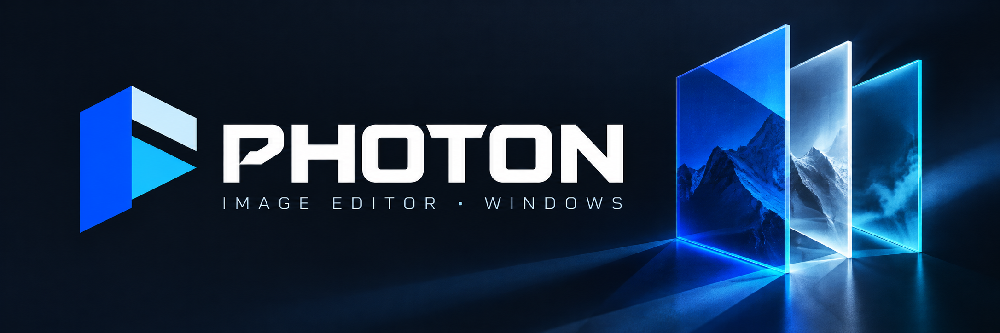
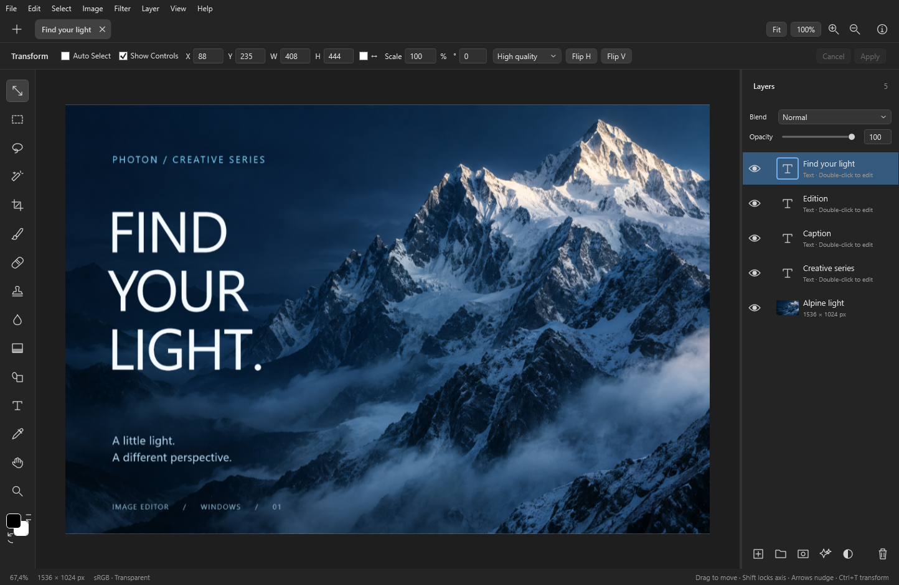

  

<strong>Русский</strong> · <a href="README.en.md">English</a>

<h1 align="center">Photon</h1>

  <strong>Фотографии, коллажи и графика — в одном редакторе.</strong> 
  Слои, маски, ретушь и цветокоррекция для ваших повседневных и творческих задач.

Бесплатно · Без подписки · Без регистрации

  
  
  

  <a href="https://github.com/epem/Photon/releases/latest"><strong>Скачать Photon для Windows →</strong></a>
  &nbsp; · &nbsp; <a href="https://github.com/epem/Photon/releases">Что нового</a>
  &nbsp; · &nbsp; <a href="https://t.me/nrgit">Комьюнити NRG</a>

 

Многослойная композиция с редактируемым текстом в Photon.

## От обработки фото до собственной композиции

Ретушируйте снимки, собирайте коллажи, создавайте обложки и графику для публикаций. Photon позволяет работать с отдельными деталями изображения и возвращаться к ним по мере развития идеи.

- **Слои и маски.** Собирайте композиции из изображений, текста и фигур. Используйте группы, режимы наложения, обтравочные маски и корректирующие слои.
- **Цвет и свет.** Настраивайте экспозицию, баланс белого и оттенки. Кривые, уровни, HSL, цветовой баланс, градиентные карты и Camera Raw помогают управлять общим настроением и отдельными цветами.
- **Ретушь и рисование.** Убирайте лишние детали штампом, восстанавливающей кистью и заливкой с учётом содержимого. Рисуйте кистью с настройками размера, жёсткости, прозрачности и сглаживания.
- **Выделение объектов.** Отделяйте объект от фона, комбинируйте выделения и уточняйте края. Удаление фона и выделение объектов работают на вашем компьютере.
- **Текст и оформление.** Добавляйте редактируемые надписи, фигуры и градиенты. Выстраивайте элементы по направляющим и привязкам, дополняйте их тенями, обводкой и свечением.

## Рабочее пространство под вас

Несколько документов во вкладках, русский и английский интерфейс, переназначаемые горячие клавиши. Язык, управление и параметры редактора доступны в **Правка → Настройки**.

Перетащите изображение на полосу вкладок, чтобы открыть новый документ, или на холст, чтобы добавить слой. Числовые поля и ползунки можно изменять колесом мыши.

**Обработка изображений выполняется локально.** Для редактирования не нужен интернет; подключение понадобится для обновлений и отправки отчётов об ошибках.

## Форматы и сохранение

| Операция | Поддержка |
|---|---|
| Открыть изображение | PNG, JPEG, TIFF, BMP, GIF, HEIC, SVG и фото в формате RAW |
| Импортировать слои | PSD и PSB: 8-битные RGB-документы |
| Продолжить работу позже | Проекты Photon `.comp` со слоями, масками и настройками |
| Экспортировать результат | PNG с прозрачностью или JPEG с предпросмотром качества |

Сложные возможности PSD/PSB могут переноситься частично. При импорте Photon показывает замечания о преобразовании.

## Скачать и начать работу

**[Последняя версия Photon для Windows x64 →](https://github.com/epem/Photon/releases/latest)**

| Вариант | Как начать |
|---|---|
| **Установщик · MSI** | Установите Photon и запускайте его из меню «Пуск». |
| **Portable · ZIP** | Распакуйте архив целиком и запустите `Photon.exe` из папки. |

Откройте изображение или создайте холст. Сохраните редактируемую работу как проект `.comp`, а готовую картинку экспортируйте в PNG или JPEG.

Обновления доступны через **Справка → Проверить обновления**. Описание изменений — в [истории выпусков](https://github.com/epem/Photon/releases).

## Поддержка и обратная связь

Заметили ошибку? Откройте **Справка → Сообщить об ошибке**, опишите, что произошло, и нажмите **Отправить отчёт**. При желании приложите снимок окна редактора — его можно проверить перед отправкой. Аккаунт GitHub не нужен.

**Отчёт и выбранный снимок публикуются в открытом багтрекере.** Не включайте данные, которые не хотите раскрывать. После отправки Photon покажет ссылку на обращение.

Если приложение не запускается, [создайте обращение на GitHub](https://github.com/epem/Photon/issues/new?template=bug_report.md).

## Полезно знать

<strong>Как перенести проект на другой компьютер?</strong>

Проект `.comp` хранится как папка. Копируйте её целиком: внутри находятся данные проекта и слоёв.

<strong>Где посмотреть и изменить горячие клавиши?</strong>

Откройте **Правка → Горячие клавиши**. Команды можно переназначить под свой рабочий процесс.

| Действие | По умолчанию |
|---|---|
| Кисть / ластик | `B` / `E` |
| Перемещение / трансформация | `V` / `Ctrl+T` |
| Отменить / повторить | `Ctrl+Z` / `Ctrl+Shift+Z` |
| Вписать холст / масштаб 100% | `Ctrl+0` / `Ctrl+1` |
| Перемещать холст | Удерживать `Пробел` |
| Размер кисти | `[` / `]` |
| Поменять цвета / сбросить цвета | `X` / `D` |

<strong>Какой файл выбрать на странице загрузки?</strong>

В разделе **Assets** выберите файл Photon с расширением **.msi** или **.zip**. Установщик подходит для обычной установки, ZIP — для запуска из папки.

Архивы **Source code**, которые GitHub добавляет автоматически, содержат материалы этого репозитория. Для запуска Photon они не подходят. Файлы `.sha256` предназначены для проверки целостности загрузки.

<strong>Почему Windows показывает неизвестного издателя?</strong>

Пакеты Photon пока не подписаны цифровым сертификатом издателя. Загружайте приложение из [официального репозитория epem/Photon](https://github.com/epem/Photon/releases/latest).

---

<h2 align="center">Берите. Творите.</h2>

Photon — подарок комьюнити от <strong>NRG</strong>. Новости проекта и новые версии — в нашем Telegram-канале.

<a href="https://t.me/nrgit"><strong>t.me/nrgit →</strong></a>

